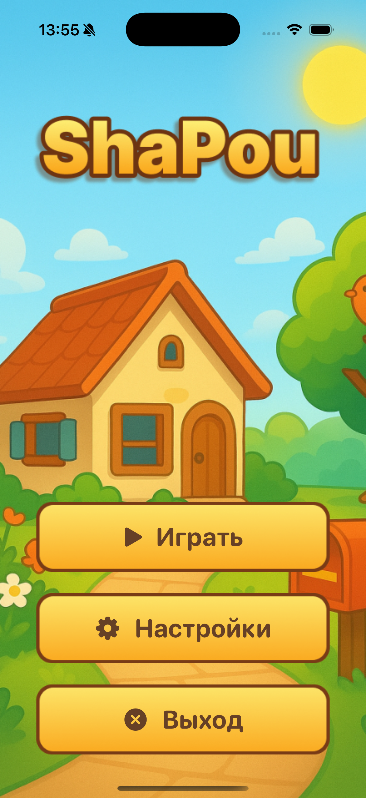
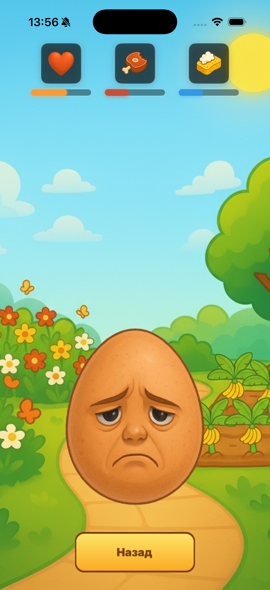
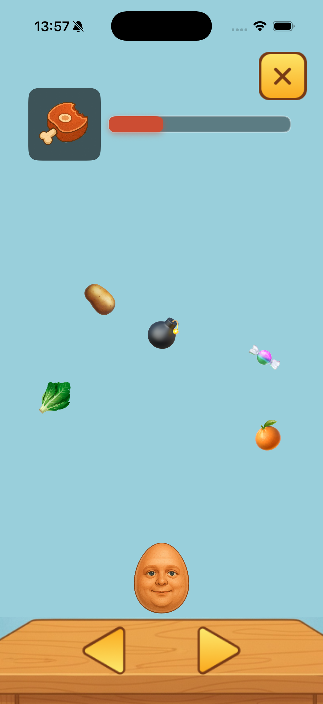
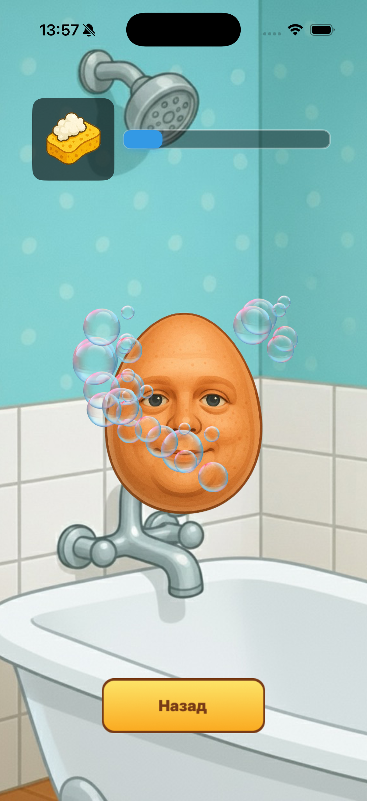

<div align="center">

# 🥚 ShaPou

### Виртуальный питомец для iOS

[](https://swift.org)
[](https://www.apple.com/ios/)
[](https://developer.apple.com/xcode/swiftui/)
[](https://developer.apple.com/xcode/)
[](LICENSE)

*Интерактивная игра-симулятор виртуального питомца с мини-играми, системой одежды, боями и отслеживанием состояния*

[Описание](#-описание) • [Возможности](#-возможности) • [Установка](#-установка) • [Структура проекта](#-структура-проекта) • [Технологии](#-технологии)

</div>

---

## 📖 Описание

**ShaPou** — это современное iOS-приложение, разработанное на SwiftUI, которое позволяет вам заботиться о виртуальном питомце. Игра сочетает в себе элементы тамагочи с интерактивными мини-играми, системой одежды, боевой системой и увлекательными сюжетными элементами, создавая захватывающий опыт взаимодействия с вашим цифровым другом.

Ваш питомец ShaPou нуждается в постоянной заботе: его нужно кормить, играть с ним, следить за его эмоциональным состоянием и чистотой. Приложение включает систему отслеживания различных параметров питомца, несколько увлекательных мини-игр, возможность одевать питомца в различные скины, боевую систему и даже сюжетные элементы с диалогами и выбором действий.

## ✨ Возможности

### 🎮 Основной функционал
- **Интерактивный виртуальный питомец** — живой персонаж с различными состояниями и эмоциями (нормальный, грустный, злой)
- **Система отслеживания состояния** — мониторинг голода, эмоций и чистоты питомца в реальном времени
- **Динамические эмоции** — питомец реагирует на ваши действия и меняет свое настроение
- **Автоматическое ухудшение параметров** — параметры постепенно уменьшаются, требуя постоянной заботы

### 🏠 Комнаты и локации
- **Главная комната** — основное место обитания питомца с доступом к другим локациям
- **Кухня** — место для кормления питомца через мини-игру
- **Ванная комната** — место для поддержания чистоты через мини-игру
- **Гардеробная** — комната для выбора и переключения скинов персонажа
- **Улица** — прогулка на свежем воздухе с доступом к огороду
- **Огород** — специальная локация с сюжетными элементами и боевыми событиями

### 🎯 Мини-игры
- **Кухонная игра (Кормление)** — ловите падающую еду, избегая бомб! Восстанавливайте уровень голода, собирая полезную еду
- **Игра с мытьем** — лопайте мыльные пузыри вокруг питомца, чтобы повысить уровень чистоты

### 👕 Система скинов
- **Переключение скинов** — выбирайте между обычным, Yandex и новогодним скинами
- **Интуитивное управление** — используйте стрелки влево/вправо для переключения между скинами
- **Визуальное отображение** — скины применяются ко всему персонажу во всех комнатах
- **Сохранение выбора** — выбранный скин сохраняется до следующего изменения

### ⚔️ Боевая система
- **Система боя** — сражайтесь с злодеем после сюжетных событий
- **Атака и защита** — используйте кнопки атаки и защиты для управления боем
- **Анимации боя** — персонажи приближаются друг к другу при атаке
- **Система здоровья** — отслеживайте здоровье игрока и врага с помощью прогресс-баров
- **Защита** — кнопка защиты снижает получаемый урон на 50%
- **Экран победы** — специальный экран с победным звуком после победы над врагом

### 🎭 Сюжетные элементы
- **Диалоги** — интерактивные диалоги с озвучкой
- **Система выбора** — принимайте важные решения (например, принять вызов на бой или убежать)
- **Сюжетные события** — специальные события после полива огорода
- **Боевые сцены** — динамичные бои с врагом на арене

### ⚙️ Настройки
- **Управление музыкой** — включение/выключение фоновой музыки
- **О приложении** — информация о версии и разработчиках
- **Политика конфиденциальности** — подробная информация о сборе и использовании данных
- **Условия использования** — правила использования приложения

### 🎨 Интерфейс
- **Современный дизайн** — красивый и интуитивный пользовательский интерфейс на SwiftUI
- **Адаптивная верстка** — оптимизация для различных размеров экранов iOS
- **Визуальная обратная связь** — анимации перекатывания между комнатами, переходы и эффекты
- **Прогресс-бары** — визуальное отображение состояния питомца с цветовой индикацией
- **Боевой интерфейс** — специальный интерфейс для боевой системы с кнопками атаки и защиты

### 🎵 Аудио
- **Фоновая музыка** — приятное музыкальное сопровождение на протяжении всей игры
- **Звуковые диалоги** — озвученные реплики персонажей
- **Звук победы** — специальный звук после победы в бою
- **Управление звуком** — автоматическое управление воспроизведением музыки и диалогов
- **Настройки звука** — возможность включения/выключения музыки в настройках

## 🚀 Установка

### Требования

- **iOS** 15.0 или выше
- **Xcode** 14.0 или выше
- **Swift** 5.7 или выше
- **macOS** для разработки

### Шаги установки

1. **Клонируйте репозиторий**
   ```bash
   git clone https://github.com/tihshkel/shapou.git
   cd shapou
   ```

2. **Откройте проект в Xcode**
   ```bash
   open ShaPou.xcodeproj
   ```

3. **Настройте проект**
   - Выберите команду разработки в настройках проекта (Signing & Capabilities)
   - Убедитесь, что все ресурсы добавлены в Target:
     - Изображения из папки `Images/` и `Assets.xcassets/`
     - Звуковые файлы из папки `Sounds/`

4. **Запустите приложение**
   - Выберите целевое устройство или симулятор
   - Нажмите `⌘R` или кнопку Run в Xcode
     

### Сборка из командной строки

```bash
xcodebuild -project ShaPou.xcodeproj -scheme ShaPou -sdk iphonesimulator -destination 'platform=iOS Simulator,name=iPhone 15'
```

## 📁 Структура проекта

```
ShaPou/
│
├── 📱 ShaPou/
│   ├── ContentView.swift          # Основной экран приложения, логика игры, мини-игры, боевая система и UI
│   ├── ShaPouApp.swift            # Точка входа приложения (@main)
│   │
│   ├── 🎨 Assets.xcassets/        # Ресурсы приложения
│   │   ├── AppIcon.appiconset/    # Иконки приложения
│   │   ├── *.imageset/            # Изображения и спрайты (персонажи, кнопки, фоны, скины)
│   │   └── AccentColor.colorset/  # Цветовая схема
│   │
│   ├── 🖼️ Images/                  # Дополнительные изображения
│   │   ├── *.png, *.jpg           # Графические ресурсы (фоны комнат, персонажи, UI элементы, скины)
│   │   ├── button-fight.png       # Кнопка атаки в бою
│   │   ├── button-protection.png  # Кнопка защиты в бою
│   │   ├── fight-arena.png        # Фон боевой арены
│   │   ├── yandex-shapou.png      # Скин Yandex
│   │   ├── newyear-shapou.png     # Новогодний скин
│   │   └── settings-*.png         # Иконки для настроек
│   │
│   └── 🔊 Sounds/                  # Аудио файлы
│       ├── music-game.mp3         # Фоновая музыка
│       ├── shapo-dialog1.mp3      # Диалоги ShaPou
│       ├── shapou-dialog2.mp3
│       ├── bad-dialog1.mp3        # Диалоги злого героя
│       ├── bad-dialog2.mp3
│       └── afterwin-dialog.wav    # Звук победы
│
└── 📦 ShaPou.xcodeproj/            # Файл проекта Xcode
    ├── project.pbxproj             # Конфигурация проекта
    └── project.xcworkspace/        # Рабочее пространство
```

## 🛠 Технологии

Проект построен с использованием современных технологий Apple:

| Технология | Описание |
|------------|----------|
| **[SwiftUI](https://developer.apple.com/xcode/swiftui/)** | Декларативный фреймворк для создания пользовательского интерфейса |
| **[AVFoundation](https://developer.apple.com/av-foundation/)** | Фреймворк для воспроизведения музыки и звуковых эффектов |
| **[UIKit](https://developer.apple.com/documentation/uikit)** | Используется для работы с изображениями и некоторыми системными компонентами |
| **[Combine](https://developer.apple.com/documentation/combine)** | Фреймворк для реактивного программирования и управления состоянием |

### Архитектурные решения

- **Singleton Pattern** — `MusicManager` и `DialogueManager` для управления аудио
- **State Management** — использование `@State`, `@Binding` и `@ObservedObject` для управления состоянием
- **MVVM Architecture** — разделение логики и представления
- **Timer-based Game Loop** — использование `Timer` для игровых циклов и автоматического уменьшения параметров
- **ObservableObject** — реактивное обновление UI при изменении состояния

## 🎮 Использование

После запуска приложения:

1. **Главное меню**
   - Нажмите "Играть" для начала игры
   - Используйте "Настройки" для настройки приложения (музыка, информация о приложении, политика конфиденциальности, условия использования)
   - "Выход" для закрытия приложения

2. **Игровой процесс**
   - **Навигация между комнатами**: используйте стрелки влево/вправо для перемещения между комнатами
   - **Следите за показателями**: обращайте внимание на иконки состояния (голод, эмоции, чистота) вверху экрана
   - **Кормление**: перейдите на кухню и нажмите кнопку "Кормить" для запуска мини-игры (доступна только если голод < 50%)
   - **Мытье**: перейдите в ванную и нажмите кнопку "Мыть" для запуска мини-игры (доступна только если чистота < 50%)
   - **Скины**: перейдите в гардеробную, нажмите "Одеть" и используйте стрелки влево/вправо для переключения между скинами (обычный, Yandex, новогодний)
   - **Прогулка**: из главной комнаты нажмите "На улицу" для прогулки
   - **Огород**: на улице нажмите "Полить" для доступа к огороду и сюжетным событиям

3. **Мини-игры**
   - **Кормление**: используйте кнопки влево/вправо для движения персонажа, ловите падающую еду (🍎, 🍌, 🍰 и др.), избегайте бомб (💣)
   - **Мытье**: нажимайте на мыльные пузыри (🫧), чтобы лопнуть их и повысить чистоту

4. **Сюжетные элементы и бой**
   - После полива огорода запускается диалог между ShaPou и злым героем
   - После диалога вам предстоит сделать выбор: принять вызов на бой или убежать
   - **Боевая система**: 
     - Используйте кнопку "Атака" для нанесения урона врагу
     - Используйте кнопку "Защита" для снижения получаемого урона на 50%
     - Следите за здоровьем игрока и врага с помощью прогресс-баров
     - После победы появится экран победы с победным звуком

5. **Настройки**
   - **Музыка**: включите/выключите фоновую музыку
   - **О приложении**: просмотрите версию приложения и список разработчиков
   - **Политика конфиденциальности**: ознакомьтесь с политикой обработки данных
   - **Условия использования**: прочитайте правила использования приложения

## 📸 Скриншоты

### Главное меню

*Главный экран приложения с кнопками запуска игры, настроек и выхода*

### Основная комната

*Главная комната, где живет ваш питомец ShaPou. Следите за показателями состояния вверху экрана*

### Кухня

*Кухня для кормления питомца. Нажмите кнопку "Кормить" для начала мини-игры*

### Ванная комната

*Ванная комната для поддержания чистоты ShaPou. Используйте кнопку "Мыть" для игры с мыльными пузырями*

### Улица

*Прогулка на свежем воздухе. Ваш питомец может наслаждаться природой и играть на улице*

### Мини-игра: Кормление

*Интерактивная мини-игра на кухне. Ловите падающую еду, избегая бомб!*

### Мини-игра: Мытье

*Мини-игра в ванной. Лопайте мыльные пузыри, чтобы помыть вашего питомца!*

## 🎯 Игровая механика

### Система параметров
- **Эмоции** (оранжевый): влияют на внешний вид питомца и его настроение
- **Голод** (красно-коричневый): требует регулярного кормления через мини-игру
- **Чистота** (голубой): требует регулярного мытья через мини-игру

### Состояния питомца
- **Нормальный** — все параметры > 50%
- **Грустный** — хотя бы один параметр ≤ 50%
- **Злой** — хотя бы один параметр = 0%

### Взаимодействие с питомцем
- Параметры автоматически уменьшаются на 1% каждую секунду
- Кормление восстанавливает голод (+10% за единицу еды)
- Мытье восстанавливает чистоту (+5% за лопнутый пузырь)
- Прогулка повышает эмоции (+20%)
- Полив огорода повышает эмоции (+10%)
- Победа в бою повышает эмоции (+30%)

### Боевая система
- **Урон от атаки**: 15% здоровья врага за удар
- **Защита**: снижает получаемый урон на 50%
- **Анимации**: персонажи приближаются друг к другу при атаке
- **Победа**: при победе над врагом появляется экран победы с звуком

### Система скинов
- **Обычный скин** — стандартный вид персонажа
- **Yandex скин** — специальный скин с тематикой Yandex
- **Новогодний скин** — праздничный скин для особых случаев
- Скины применяются ко всему персонажу во всех комнатах

## 🤝 Вклад в проект

Мы приветствуем вклад в развитие проекта! Если вы хотите внести свой вклад:

1. Fork проекта
2. Создайте ветку для новой функции (`git checkout -b feature/AmazingFeature`)
3. Зафиксируйте изменения (`git commit -m 'Add some AmazingFeature'`)
4. Отправьте в ветку (`git push origin feature/AmazingFeature`)
5. Откройте Pull Request

## 📝 Лицензия

Этот проект создан для образовательных целей.

## 👥 Разработчики

Проект разработан командой:

- **Шкель Тихон**
- **Тихонович Даниил**
- **Лусевич Арсений**
- **Круглик Виолетта**
- **Лютаревич Ульяна**

### Контакты

- GitHub: [@tihshkel](https://github.com/tihshkel)
- GitHub: [@hulanalutarevic-create](https://github.com/ulanalutarevic-create)
- Email: denitihonovich@gmail.com
- Email: arsenlusev@gmail.com
- GitHub: [@diffkaa](https://github.com/diffkaa)

## 🙏 Благодарности

- Apple за предоставление отличных инструментов разработки
- Сообщество SwiftUI за вдохновение и примеры

---

<div align="center">

**Сделано с ❤️ используя SwiftUI**

⭐ Если проект вам понравился, поставьте звезду!

</div>
